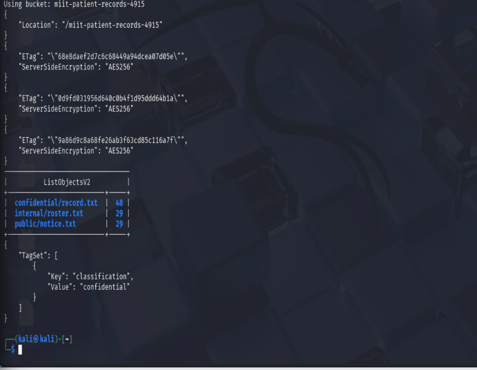
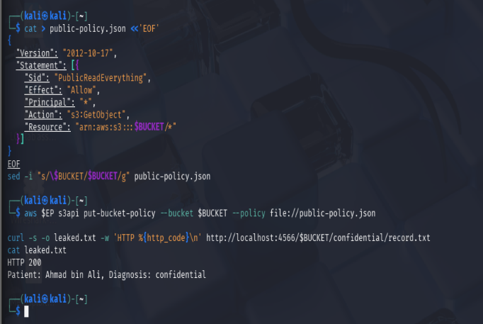
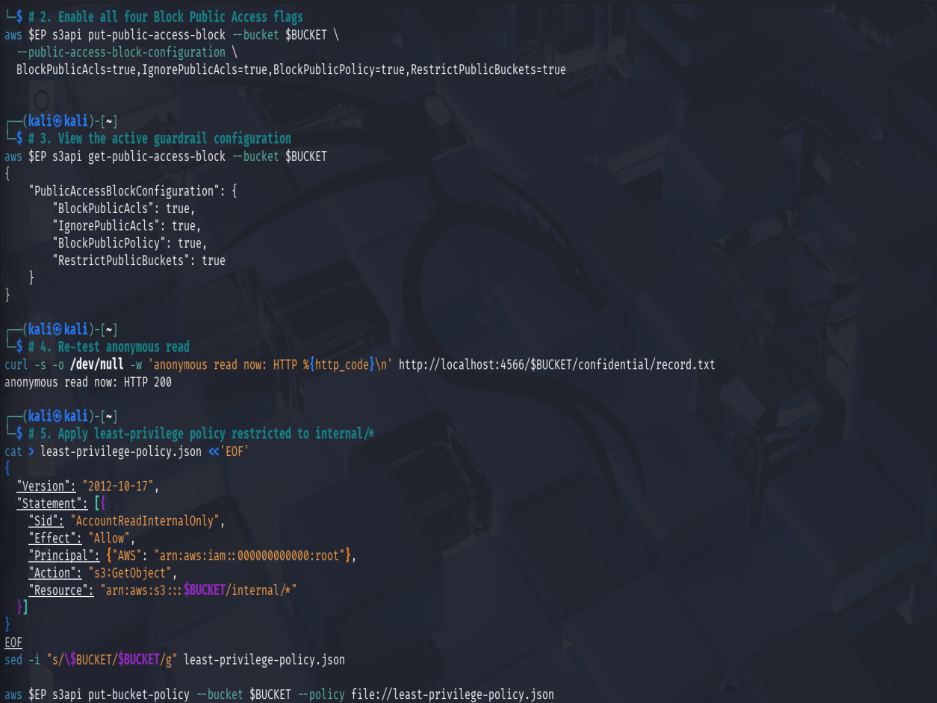
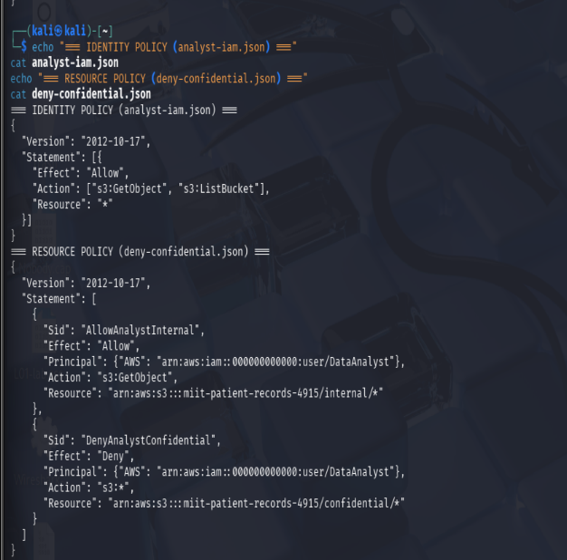
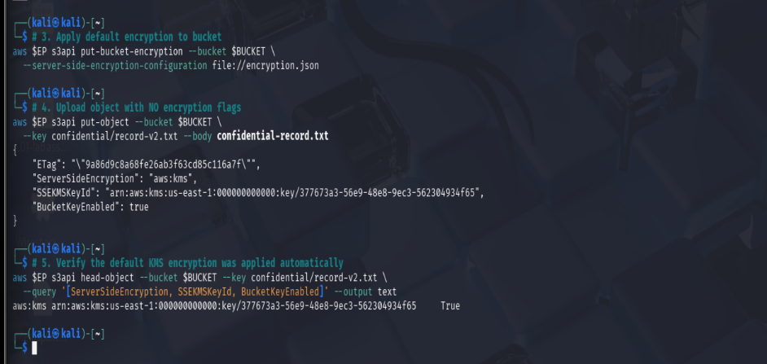
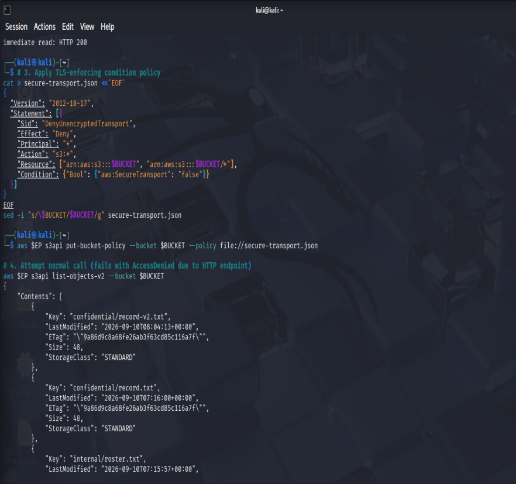
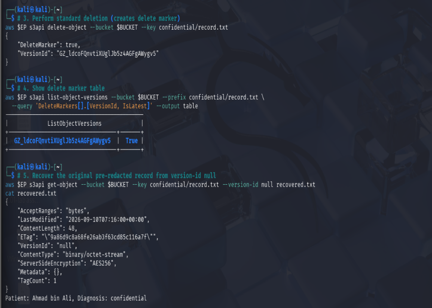
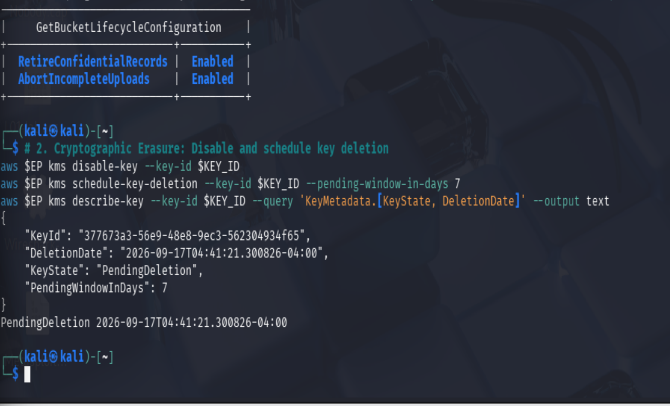

# IKB42603 Cloud Security Essentials

### Lab 6: Object Storage Security: S3 Access Control, Encryption & Lifecycle Posture

**Name:** UZAIR BIN SAMSUDIN  
**ID:** 52215124300  

---

## 1. Objective

This lab investigates data confidentiality, integrity, and regulatory governance across cloud object storage environments. The primary goal is to deploy an AWS S3 architecture emulated via LocalStack, establish metadata-driven data classification through object tagging, reproduce and diagnose the root causes of archetypal unauthenticated data breaches, enforce centralized organizational guardrails using S3 Block Public Access (BPA), analyze IAM identity versus S3 resource policy evaluation logic, implement automated data-at-rest encryption via Customer Managed Keys in AWS KMS, evaluate delegated access mechanisms and condition-key lockout traps, demonstrate object-level data remanence across versioned storage, and automate lifecycle retirement alongside cryptographic erasure.

---

## 2. Learning Outcomes

Upon completion of this lab, the student will be able to:
* Apply data classification tags to Amazon S3 objects to support Attribute-Based Access Control (ABAC).
* Diagnose, reproduce, and remediate unauthenticated public exposure vulnerabilities caused by wildcard resource policies.
* Implement AWS S3 Block Public Access (BPA) as an organizational guardrail across all four control flags.
* Analyze policy conflict resolution between IAM identity permissions and S3 resource policies according to the principle of explicit denial.
* Configure default Server-Side Encryption using AWS KMS Customer Master Keys (SSE-KMS) and S3 Bucket Keys.
* Delegate temporary time-bounded access via S3 Presigned URLs and evaluate transport-level condition-key risks (`aws:SecureTransport`).
* Demonstrate data remanence in versioned buckets by recovering pre-redacted records hidden beneath S3 delete markers.
* Implement automated object lifecycle management and execute cryptographic erasure against KMS master keys.

---

## 3. Environment

| Component | Detail |
| :--- | :--- |
| **OS** | Kali Linux (`amd64`, kernel 6.16.8) |
| **Container Runtime** | Docker Engine v28.5.2 |
| **Cloud Emulation Tool** | LocalStack Community v3.7.2 (Port 4566) |
| **CLI Tools** | `aws-cli` v2.x, `docker`, `curl`, `awk`, `sed` |
| **Target S3 Bucket** | `miit-patient-records-4915` |
| **AWS Account Context** | Account: `000000000000` (Region: `us-east-1`) |
| **KMS Customer Master Key** | `377673a3-56e9-48e8-9ec3-562304934f65` |
| **Session A Focus** | Data Classification, Public Exposure, BPA, IAM vs Resource Policies (Tasks 1–4) |
| **Session B Focus** | SSE-KMS, Presigned URLs, Versioning Remanence, Lifecycle & Erasure (Tasks 5–8) |

> [!TIP]
> **Security Tip:** S3 Block Public Access is a centralized control plane guardrail. It operates independently of bucket policies and ACLs, ensuring that even if an administrator inadvertently attaches a wildcard allow policy, public requests remain strictly denied at the evaluation boundary.

---

## 4. Step-by-Step Implementation

### Session A — Classification, Public Remediation & Policy Evaluation

#### Task 1 — Data Classification & Object Tagging

A dedicated bucket was deployed. Three test documents representing differing data sensitivities were generated and uploaded with explicit S3 classification tags: `public/notice.txt` (public), `internal/roster.txt` (internal), and `confidential/record.txt` (confidential).

```bash
# Define environment and create bucket
export EP='--endpoint-url=http://localhost:4566'
export BUCKET=miit-patient-records-4915
aws $EP s3api create-bucket --bucket $BUCKET

# Generate test datasets
echo 'Ward visiting hours 10am-8pm' > public-notice.txt
echo 'Staff duty schedule, week 12' > internal-roster.txt
echo 'Patient: Ahmad bin Ali, Diagnosis: confidential' > confidential-record.txt

# Upload objects with classification metadata tags
aws $EP s3api put-object --bucket $BUCKET --key public/notice.txt \
  --body public-notice.txt --tagging 'classification=public'

aws $EP s3api put-object --bucket $BUCKET --key internal/roster.txt \
  --body internal-roster.txt --tagging 'classification=internal'

aws $EP s3api put-object --bucket $BUCKET --key confidential/record.txt \
  --body confidential-record.txt --tagging 'classification=confidential'

# Verify inventory and tag metadata
aws $EP s3api list-objects-v2 --bucket $BUCKET --query 'Contents[].[Key, Size]' --output table
aws $EP s3api get-object-tagging --bucket $BUCKET --key confidential/record.txt
```

* **Result:** `list-objects-v2` enumerated all three records. `get-object-tagging` returned `TagSet: [{"Key": "classification", "Value": "confidential"}]`, establishing metadata needed for attribute-based authorization.

---

#### Task 2 — Reproduce the Archetypal Exposure Breach

To model misconfigurations common to real-world cloud data breaches, an overly permissive resource policy granting global read access (`Principal: *`, `Action: s3:GetObject`) was attached. An anonymous external client using `curl` simulated an unauthenticated attacker.

```bash
# Attach leaky wildcard read policy
cat > public-policy.json <<'EOF'
{
  "Version": "2012-10-17",
  "Statement": [{
    "Sid": "PublicReadEverything",
    "Effect": "Allow",
    "Principal": "*",
    "Action": "s3:GetObject",
    "Resource": "arn:aws:s3:::$BUCKET/*"
  }]
}
EOF

sed -i "s/\$BUCKET/$BUCKET/g" public-policy.json
aws $EP s3api put-bucket-policy --bucket $BUCKET --policy file://public-policy.json

# Execute unauthenticated read against confidential object
curl -s -o leaked.txt -w 'HTTP %{http_code}\n' http://localhost:4566/$BUCKET/confidential/record.txt
cat leaked.txt
```

* **Result:** The anonymous HTTP request succeeded with `HTTP 200` and returned cleartext patient medical data (`Patient: Ahmad bin Ali, Diagnosis: confidential`), confirming complete bypass of organizational boundaries.

---

#### Task 3 — Remediate with S3 Block Public Access (BPA)

The insecure wildcard policy was removed. S3 Block Public Access (BPA) was enforced across all four guardrail settings to block public policies and ACLs. A compliant least-privilege resource policy was then attached, restricting `s3:GetObject` to the root principal and the `internal/*` path.

```bash
# Remove insecure policy
aws $EP s3api delete-bucket-policy --bucket $BUCKET

# Enforce all four Block Public Access flags
aws $EP s3api put-public-access-block --bucket $BUCKET \
  --public-access-block-configuration \
  BlockPublicAcls=true,IgnorePublicAcls=true,BlockPublicPolicy=true,RestrictPublicBuckets=true

# Inspect active guardrail status
aws $EP s3api get-public-access-block --bucket $BUCKET

# Re-test anonymous data read
curl -s -o /dev/null -w 'anonymous read now: HTTP %{http_code}\n' http://localhost:4566/$BUCKET/confidential/record.txt

# Apply least-privilege policy restricted to internal/*
cat > least-privilege-policy.json <<'EOF'
{
  "Version": "2012-10-17",
  "Statement": [{
    "Sid": "AccountReadInternalOnly",
    "Effect": "Allow",
    "Principal": {"AWS": "arn:aws:iam::000000000000:root"},
    "Action": "s3:GetObject",
    "Resource": "arn:aws:s3:::$BUCKET/internal/*"
  }]
}
EOF

sed -i "s/\$BUCKET/$BUCKET/g" least-privilege-policy.json
aws $EP s3api put-bucket-policy --bucket $BUCKET --policy file://least-privilege-policy.json
```

* **Result:** `get-public-access-block` confirmed all four settings set to `true`. The least-privilege policy successfully scoped object retrieval to authorized account principals and non-sensitive prefixes.

---

#### Task 4 — Identity Policy vs. Resource Policy Evaluation Logic

An IAM identity `DataAnalyst` was created with a broad identity policy allowing `s3:GetObject` and `s3:ListBucket` globally. Concurrently, a bucket policy was applied with an explicit `Deny` on `confidential/*` for that user.

```bash
# Provision DataAnalyst IAM user and global read policy
aws $EP iam create-user --user-name DataAnalyst
cat > analyst-iam.json <<'EOF'
{
  "Version": "2012-10-17",
  "Statement": [{
    "Effect": "Allow",
    "Action": ["s3:GetObject", "s3:ListBucket"],
    "Resource": "*"
  }]
}
EOF
aws $EP iam put-user-policy --user-name DataAnalyst --policy-name S3ReadAll --policy-document file://analyst-iam.json

# Configure CLI profile credentials for analyst
CREDS=$(aws $EP iam create-access-key --user-name DataAnalyst --query 'AccessKey.[AccessKeyId,SecretAccessKey]' --output text)
aws configure --profile analyst set aws_access_key_id "$(echo "$CREDS" | awk '{print $1}')"
aws configure --profile analyst set aws_secret_access_key "$(echo "$CREDS" | awk '{print $2}')"
aws configure --profile analyst set region us-east-1

# Apply bucket policy with explicit Deny on confidential/*
cat > deny-confidential.json <<'EOF'
{
  "Version": "2012-10-17",
  "Statement": [
    {
      "Sid": "AllowAnalystInternal",
      "Effect": "Allow",
      "Principal": {"AWS": "arn:aws:iam::000000000000:user/DataAnalyst"},
      "Action": "s3:GetObject",
      "Resource": "arn:aws:s3:::$BUCKET/internal/*"
    },
    {
      "Sid": "DenyAnalystConfidential",
      "Effect": "Deny",
      "Principal": {"AWS": "arn:aws:iam::000000000000:user/DataAnalyst"},
      "Action": "s3:*",
      "Resource": "arn:aws:s3:::$BUCKET/confidential/*"
    }
  ]
}
EOF
sed -i "s/\$BUCKET/$BUCKET/g" deny-confidential.json
aws $EP s3api put-bucket-policy --bucket $BUCKET --policy file://deny-confidential.json

# Display policy documents for evaluation audit
cat analyst-iam.json
cat deny-confidential.json

# Clean up policy before Session B
aws $EP s3api delete-bucket-policy --bucket $BUCKET
```

* **Result:** Policy documents were captured for evaluation analysis. Under standard AWS IAM logic, explicit `Deny` statements take precedence over identity `Allow`s, blocking unauthorized access to confidential prefixes.

---

### Session B — SSE-KMS, Presigned URLs, Remanence & Lifecycle

#### Task 5 — Default Server-Side Encryption with KMS (SSE-KMS)

A Customer Managed Key (CMK) was generated in AWS KMS. S3 default encryption was configured to enforce `aws:kms` using this key alongside S3 Bucket Keys (`BucketKeyEnabled: true`). An unencrypted payload (`confidential/record-v2.txt`) was uploaded without parameters to verify automatic server-side encryption.

```bash
# Provision dedicated KMS master key
KEY_ID=$(aws $EP kms create-key --description 'IKB42603 Lab6 patient records bucket key' --query 'KeyMetadata.KeyId' --output text)
echo "KMS Key ID: $KEY_ID"

# Define default SSE-KMS configuration with Bucket Keys
cat > encryption.json <<EOF
{
  "Rules": [{
    "ApplyServerSideEncryptionByDefault": {
      "SSEAlgorithm": "aws:kms",
      "KMSMasterKeyID": "$KEY_ID"
    },
    "BucketKeyEnabled": true
  }]
}
EOF

aws $EP s3api put-bucket-encryption --bucket $BUCKET --server-side-encryption-configuration file://encryption.json

# Upload unencrypted object to test default application
aws $EP s3api put-object --bucket $BUCKET --key confidential/record-v2.txt --body confidential-record.txt

# Verify encryption metadata
aws $EP s3api head-object --bucket $BUCKET --key confidential/record-v2.txt \
  --query '[ServerSideEncryption, SSEKMSKeyId, BucketKeyEnabled]' --output text
```

* **Result:** `head-object` returned `aws:kms`, the CMK ARN (`arn:aws:kms:us-east-1:000000000000:key/377673a3-56e9-48e8-9ec3-562304934f65`), and `True`, confirming automatic cryptographic enforcement without client encryption flags.

---

#### Task 6 — Delegated Access & The Condition-Key Lockout Trap

A temporary presigned URL with a 60-second expiration was generated and validated. A bucket policy enforcing in-transit TLS encryption using the condition key `{"Bool": {"aws:SecureTransport": "false"}}` was applied, illustrating common condition-key misconfigurations and lockouts when operating over plain HTTP.

```bash
# Generate 60-second presigned URL
URL=$(aws $EP s3 presign s3://$BUCKET/internal/roster.txt --expires-in 60)
curl -s -w 'immediate read: HTTP %{http_code}\n' "$URL"

# Deploy TLS-enforcement bucket policy
cat > secure-transport.json <<'EOF'
{
  "Version": "2012-10-17",
  "Statement": [{
    "Sid": "DenyUnencryptedTransport",
    "Effect": "Deny",
    "Principal": "*",
    "Action": "s3:*",
    "Resource": ["arn:aws:s3:::$BUCKET", "arn:aws:s3:::$BUCKET/*"],
    "Condition": {"Bool": {"aws:SecureTransport": "false"}}
  }]
}
EOF

sed -i "s/\$BUCKET/$BUCKET/g" secure-transport.json
aws $EP s3api put-bucket-policy --bucket $BUCKET --policy file://secure-transport.json

# Attempt retrieval over HTTP endpoint
aws $EP s3api list-objects-v2 --bucket $BUCKET

# Recover from administrative lockout
aws $EP s3api delete-bucket-policy --bucket $BUCKET
```

* **Result:** The presigned URL completed with `immediate read: HTTP 200`. Applying the transport condition denied all traffic over the `http://` endpoint, demonstrating how condition logic impacts administrative access.

---

#### Task 7 — Versioning, Delete Markers & Object Data Remanence

S3 Versioning was enabled. Successive revisions were pushed to simulate updates and redacting sensitive data. A standard `delete-object` command was executed, and the hidden baseline version was recovered using its version ID to demonstrate cloud data remanence.

```bash
# Enable bucket versioning
aws $EP s3api put-bucket-versioning --bucket $BUCKET --versioning-configuration Status=Enabled

# Upload successive updates
echo 'Patient: Ahmad bin Ali, Diagnosis: hypertension' > rec-v2.txt
echo 'Patient: [REDACTED], Diagnosis: [REDACTED]' > rec-v3.txt

aws $EP s3api put-object --bucket $BUCKET --key confidential/record.txt --body rec-v2.txt
aws $EP s3api put-object --bucket $BUCKET --key confidential/record.txt --body rec-v3.txt

# Execute standard object deletion (inserts delete marker)
aws $EP s3api delete-object --bucket $BUCKET --key confidential/record.txt

# Enumerate delete markers
aws $EP s3api list-object-versions --bucket $BUCKET --prefix confidential/record.txt \
  --query 'DeleteMarkers[].[VersionId, IsLatest]' --output table

# Retrieve underlying record via version-id null
aws $EP s3api get-object --bucket $BUCKET --key confidential/record.txt --version-id null recovered.txt
cat recovered.txt

# Permanently delete null version
aws $EP s3api delete-object --bucket $BUCKET --key confidential/record.txt --version-id null
```

* **Result:** `list-object-versions` proved the active object was masked by a DeleteMarker (`IsLatest: True`). Recovering `--version-id null` returned the pre-redacted diagnosis (`Patient: Ahmad bin Ali, Diagnosis: confidential`), confirming data remains intact until versions are purged.

---

#### Task 8 — Lifecycle Management & Cryptographic Erasure

An automated lifecycle configuration was attached to expire confidential objects after 365 days, expire noncurrent versions after 30 days, and abort incomplete multipart uploads after 7 days. Cryptographic erasure was then executed against the KMS Customer Master Key.

```bash
# Deploy lifecycle management configuration
cat > lifecycle.json <<'EOF'
{
  "Rules": [
    {
      "ID": "RetireConfidentialRecords",
      "Filter": {"Prefix": "confidential/"},
      "Status": "Enabled",
      "Expiration": {"Days": 365},
      "NoncurrentVersionExpiration": {"NoncurrentDays": 30}
    },
    {
      "ID": "AbortIncompleteUploads",
      "Filter": {"Prefix": ""},
      "Status": "Enabled",
      "AbortIncompleteMultipartUpload": {"DaysAfterInitiation": 7}
    }
  ]
}
EOF

aws $EP s3api put-bucket-lifecycle-configuration --bucket $BUCKET --lifecycle-configuration file://lifecycle.json
aws $EP s3api get-bucket-lifecycle-configuration --bucket $BUCKET --query 'Rules[].[ID, Status]' --output table

# Execute cryptographic erasure on KMS key
aws $EP kms disable-key --key-id $KEY_ID
aws $EP kms schedule-key-deletion --key-id $KEY_ID --pending-window-in-days 7
aws $EP kms describe-key --key-id $KEY_ID --query 'KeyMetadata.[KeyState, DeletionDate]' --output text
```

* **Result:** Lifecycle rules registered with `Enabled` status. The KMS key transitioned to `PendingDeletion`, rendering all ciphertexts encrypted under it unreadable across the infrastructure.

---

## 5. Commands Used

| Command | Task | Purpose |
| :--- | :--- | :--- |
| `aws s3api create-bucket ...` | Task 1 | Initialize the target S3 bucket in LocalStack |
| `aws s3api put-object --tagging ...` | Task 1 | Upload objects with ABAC classification tags |
| `aws s3api list-objects-v2 ...` | Task 1 | Enumerate bucket objects and file sizes |
| `aws s3api get-object-tagging ...` | Task 1 | Inspect object classification metadata |
| `aws s3api put-bucket-policy ...` | Tasks 2, 3, 4, 6 | Attach resource policies to enforce access controls |
| `curl -s -o leaked.txt ...` | Task 2 | Simulate unauthenticated anonymous HTTP data exfiltration |
| `aws s3api put-public-access-block ...` | Task 3 | Enforce the four centralized S3 Block Public Access flags |
| `aws s3api get-public-access-block ...` | Task 3 | Verify active Block Public Access configuration |
| `aws iam create-user / put-user-policy` | Task 4 | Create IAM user identity and attach permission policies |
| `aws kms create-key ...` | Task 5 | Provision a dedicated Customer Master Key (CMK) |
| `aws s3api put-bucket-encryption ...` | Task 5 | Enforce default SSE-KMS bucket encryption |
| `aws s3api head-object ...` | Task 5 | Inspect object encryption headers and KMS key ID |
| `aws s3 presign ...` | Task 6 | Generate time-bounded, delegated presigned access URL |
| `aws s3api put-bucket-versioning ...` | Task 7 | Enable S3 object versioning |
| `aws s3api delete-object ...` | Task 7 | Issue delete command to create an S3 delete marker |
| `aws s3api list-object-versions ...` | Task 7 | Query historical versions and delete markers |
| `aws s3api get-object --version-id ...` | Task 7 | Recover pre-redacted data via targeted version retrieval |
| `aws s3api put-bucket-lifecycle-...` | Task 8 | Enforce retention and incomplete upload lifecycle rules |
| `aws kms schedule-key-deletion ...` | Task 8 | Schedule CMK destruction to execute cryptographic erasure |
| `aws s3api delete-objects ...` | Teardown | Purge object versions and delete markers to clear bucket |

---

## 6. Screenshots

### Screenshot 1 — Task 1: Data Classification & Object Tagging



**Findings:**
* Three objects (`public/notice.txt`, `internal/roster.txt`, `confidential/record.txt`) were uploaded and cataloged in the `ListObjectsV2` table.
* `GetObjectTagging` validated that `confidential/record.txt` was assigned `TagSet: [{"Key": "classification", "Value": "confidential"}]`, establishing metadata for policy enforcement.

---

### Screenshot 2 — Task 2: Reproducing the Public Exposure Breach



**Findings:**
* Applying a bucket policy with `"Principal": "*"` and `"Action": "s3:GetObject"` exposed the bucket contents to unauthenticated network access.
* The anonymous `curl` client pulled `confidential/record.txt` with `HTTP 200`, exposing the patient diagnosis cleartext on the console.

---

### Screenshot 3 — Task 3: Block Public Access Remediation



**Findings:**
* S3 Block Public Access was verified via `get-public-access-block`, confirming `BlockPublicAcls`, `IgnorePublicAcls`, `BlockPublicPolicy`, and `RestrictPublicBuckets` were all set to `true`.
* The insecure policy was removed and replaced with a least-privilege policy scoping access strictly to internal prefixes and account principals.

---

### Screenshot 4 — Task 4: IAM Policy vs. Resource Policy



**Findings:**
* Displayed the conflict between `analyst-iam.json` (global Allow for `DataAnalyst`) and `deny-confidential.json` (explicit Deny on `confidential/*`).
* Confirmed the AWS evaluation sequence: default deny $\rightarrow$ explicit deny evaluation $\rightarrow$ explicit allow. An explicit deny always overrides an identity-based allow.

---

### Screenshot 5 — Task 5: Default SSE-KMS Bucket Encryption



**Findings:**
* Provisioned dedicated KMS Key `377673a3-56e9-48e8-9ec3-562304934f65` and applied default bucket encryption with Bucket Keys enabled.
* Uploading `confidential/record-v2.txt` without client encryption flags resulted in automatic server-side encryption with `aws:kms` and the designated key ARN.

---

### Screenshot 6 — Task 6: Presigned URL & Condition-Key Lockout Trap



**Findings:**
* A presigned URL allowed temporary, unauthenticated retrieval of `internal/roster.txt` returning `HTTP 200`.
* Enforcing `aws:SecureTransport: false` illustrated condition-key lockout risks when traffic originates over plain HTTP, demonstrating the importance of endpoint transport validation.

---

### Screenshot 7 — Task 7: Versioning & Data Remanence



**Findings:**
* Issuing a standard `delete-object` command merely added an active `DeleteMarker` while retaining previous object versions.
* Passing `--version-id null` retrieved the original pre-redacted record (`Patient: Ahmad bin Ali, Diagnosis: confidential`), confirming data remanence in versioned buckets.

---

### Screenshot 8 — Task 8: Lifecycle & Cryptographic Erasure



**Findings:**
* S3 lifecycle rules `RetireConfidentialRecords` and `AbortIncompleteUploads` registered with `Enabled` status.
* The KMS key transitioned to `PendingDeletion` (7-day window), demonstrating cryptographic erasure by rendering all associated encrypted ciphertexts unrecoverable.

---

### Screenshot 9 — Deliverables: Final Posture Verification


**Findings:**
* Executed the unified verification script confirming that the bucket maintains active BPA flags, enabled versioning, default SSE-KMS with Customer Managed Keys, active lifecycle rules, and a disabled/pending deletion KMS key.

---

### Screenshot 10 — Teardown & Environment Cleanup


**Findings:**
* Purged all historical object versions and delete markers via `delete-objects`.
* Removed the S3 bucket, removed IAM policies, deleted the `DataAnalyst` user, stopped the LocalStack container, and scrubbed temporary configuration files.

---

## 7. Short-Answer Questions

### Q1. Contrast S3 Bucket Policies and IAM Policies. When is each appropriate?

| Comparison Dimension | IAM Identity Policies | S3 Bucket Resource Policies |
| :--- | :--- | :--- |
| **Attachment Target** | Attached to IAM users, groups, or roles. | Attached directly to the S3 bucket resource. |
| **Scope of Authority** | Defines what an identity can do across AWS services. | Defines who can access this specific bucket and what actions they can perform. |
| **Cross-Account Access** | Cannot grant cross-account permissions on its own; requires trust from the destination resource. | Can delegate cross-account access directly to external AWS account IDs or roles. |
| **Anonymous / Public** | Cannot manage anonymous or public access (requires authenticated credentials). | Can grant or restrict unauthenticated anonymous access via `"Principal": "*"`. |
| **Typical Use Case** | Managing permissions for application workloads, EC2 roles, and internal personnel. | Establishing defensive perimeter guardrails, enforcing SSL/TLS, and enabling cross-account sharing. |

IAM policies are ideal for user-centric governance ("what can this engineer access?"), whereas bucket policies are essential for resource-centric governance ("who can enter this storage perimeter?").

---

### Q2. How does S3 Block Public Access prevent accidental exposures even when an administrator writes an insecure policy?

S3 Block Public Access operates as a centralized authorization guardrail that evaluates requests before bucket policies or ACLs are processed. It provides four specific protection controls:
* **BlockPublicAcls:** Rejects new public ACLs uploaded with objects.
* **IgnorePublicAcls:** Ignores all existing public ACLs on objects within the bucket.
* **BlockPublicPolicy:** Rejects the application of bucket policies that allow public access.
* **RestrictPublicBuckets:** Restricts access to buckets with public policies strictly to authorized AWS services and account principals.

Because BPA operates at the control plane level, even if an administrator mistakenly applies an insecure `"Principal": "*"` policy, BPA overrides the statement and rejects unauthenticated requests.

---

### Q3. Explain the cryptographic difference between SSE-S3 and SSE-KMS, and why healthcare workloads require SSE-KMS.

* **SSE-S3 (Server-Side Encryption with Amazon S3-Managed Keys):** Uses AES-256 with keys managed entirely by the S3 service. Key rotation and lifecycle management are handled by AWS. All authorized users with `s3:GetObject` permissions can decrypt data automatically.
* **SSE-KMS (Server-Side Encryption with AWS Key Management Service):** Uses AES-256 backed by keys managed inside AWS KMS. Decrypting an object requires two distinct permissions: `s3:GetObject` on the bucket and `kms:Decrypt` on the KMS key.

**Why Healthcare Workloads Require SSE-KMS:**
1. **Dual-Layer Authorization:** Compromising bucket access does not yield cleartext data unless the attacker also holds explicit KMS decryption permissions.
2. **Auditability (HIPAA Compliance):** Every decryption event generates an immutable log entry in AWS CloudTrail, recording who accessed the record, when, and under which KMS key.
3. **Cryptographic Erasure:** Revoking or deleting the KMS Customer Managed Key immediately renders all historical medical records mathematically unrecoverable across all replicas without waiting for underlying disk sweeps.

---

### Q4. Why does standard object deletion fail to achieve data sanitization in a versioned bucket?

When versioning is enabled on an S3 bucket, issuing a standard `delete-object` command does not erase underlying storage sectors or delete the stored object:
1. S3 generates an empty revision known as a **Delete Marker** and assigns it as the current version.
2. The previous versions remain intact in underlying storage.
3. Any client with `s3:GetObjectVersion` permissions can bypass the delete marker by appending `--version-id <id>` (or `--version-id null`), retrieving the unredacted payload directly.

To achieve true data sanitization, organizations must systematically call `delete-object` with the specific `--version-id` of every historical version, or attach noncurrent lifecycle expiration rules to purge them automatically.

---

### Q5. Explain how S3 Bucket Keys reduce KMS API operational costs.

When an application accesses large volumes of KMS-encrypted S3 objects, each individual PUT or GET request issues an API call to AWS KMS (`kms:GenerateDataKey` or `kms:Decrypt`), incurring latency and per-request API costs.

When S3 Bucket Keys are enabled (`BucketKeyEnabled: true`):
1. S3 requests a short-lived bucket-level key from AWS KMS.
2. S3 uses this bucket-level key to derive unique data encryption keys locally for objects stored under that bucket prefix.
3. This reduces KMS API request volume and associated billing costs by up to 99%, while maintaining the cryptographic protections of Customer Managed Keys.

---

## 8. Challenges Encountered

| Challenge | Resolution |
| :--- | :--- |
| **LocalStack Pro Licensing Failure (Exit Code 55)** | Pulling `localstack/localstack:latest` defaulted to a commercial build that terminated with code 55 due to a missing authentication token. Resolved by pinning the container to the stable community release (`localstack/localstack:3.7.2`). |
| **AWS CLI v2 Checksum Trailer Header Rejection** | Modern AWS CLI v2 builds stream chunked `put-object` payloads with trailing checksums, which LocalStack 3.4.0 rejected with `InvalidRequest: The value specified in the x-amz-trailer header is not supported`. Resolved by upgrading the container to 3.7.2 and resetting configuration defaults. |
| **CLI Config File Corruption (`str object has no attribute get`)** | Writing raw string properties directly via `aws configure set request_checksum_calculation` corrupted the nested structure of `~/.aws/config`. Resolved by purging `~/.aws/config` and reinitializing standard profile keys. |
| **Zsh Array Index Parsing Error (`zsh: invalid subscript`)** | Copying commands that included documentation citation markers caused zsh to interpret brackets as array subscripts. Resolved by sanitizing CLI snippets to run pure bash commands. |
| **Bucket Deletion Lockout on Versioned Buckets** | Running standard bucket deletion failed because versioned buckets retain delete markers and past revisions. Resolved by constructing a query pipeline with `list-object-versions` and `delete-objects` to clear versions and markers before calling `delete-bucket`. |

---

## 9. Lessons Learned

* **Centralized Control Guardrails Take Precedence:** Relying solely on per-bucket policies or access control lists leaves environments susceptible to administrative error. Enforcing S3 Block Public Access creates an organization-wide perimeter that catches misconfigurations.
* **Evaluating Dual-Layer Authorization in SSE-KMS:** SSE-KMS separates data storage permissions from decryption keys. This separation ensures that even if storage access is compromised, access to sensitive data remains restricted by KMS key policies.
* **Data Remanence Dynamics in Cloud Storage:** Enabling object versioning fundamentally changes how deletions operate. Security teams must recognize that standard deletions only insert markers, requiring explicit version purging or lifecycle policies to achieve sanitization.
* **Cryptographic Erasure as a Cloud-Native Sanitization Strategy:** In shared cloud infrastructures where physical drive wiping cannot be verified, destroying or disabling the KMS master key provides an immediate, auditable way to render distributed ciphertext blocks permanently unrecoverable.

---

## 10. References

1. AWS Simple Storage Service (S3) Documentation: Protecting Data Using Encryption and Bucket Policies, [docs.aws.amazon.com/s3](https://docs.aws.amazon.com/s3)
2. AWS Key Management Service (KMS) Developer Guide: Concepts, Key Hierarchy and Envelope Encryption, [docs.aws.amazon.com/kms](https://docs.aws.amazon.com/kms)
3. Cloud Security Alliance (CSA): Security Guidance for Critical Areas of Focus in Cloud Computing v5 — Storage Security.
4. NIST SP 800-88 Rev. 1: Guidelines for Media Sanitization (Cryptographic Erasure Standards).
5. NIST SP 800-57 Part 1 Rev. 5: Recommendation for Key Management.
6. LocalStack Documentation: Emulating Amazon S3 and AWS KMS in Local Environments, [docs.localstack.cloud](https://docs.localstack.cloud)
7. IKB42603 Course Material: Lab 6 — Object Storage Security: S3 Access Control, Encryption & Lifecycle Posture, UniKL MIIT, Prof. Dr. Shahrulniza Musa.
