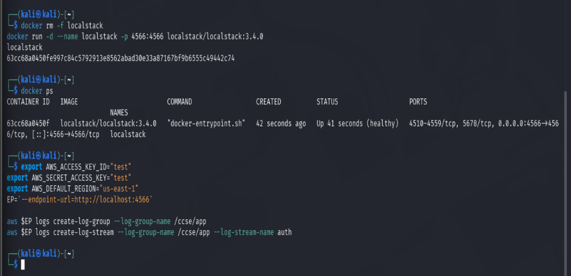
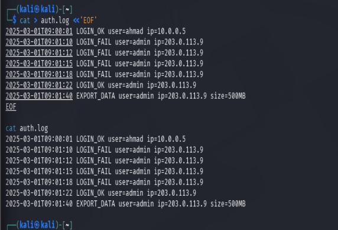
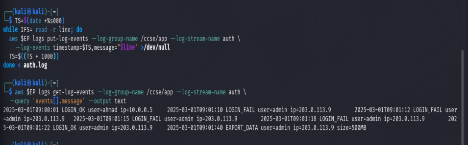
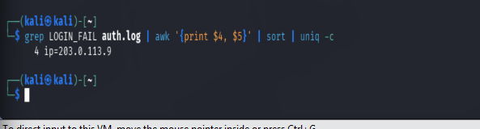
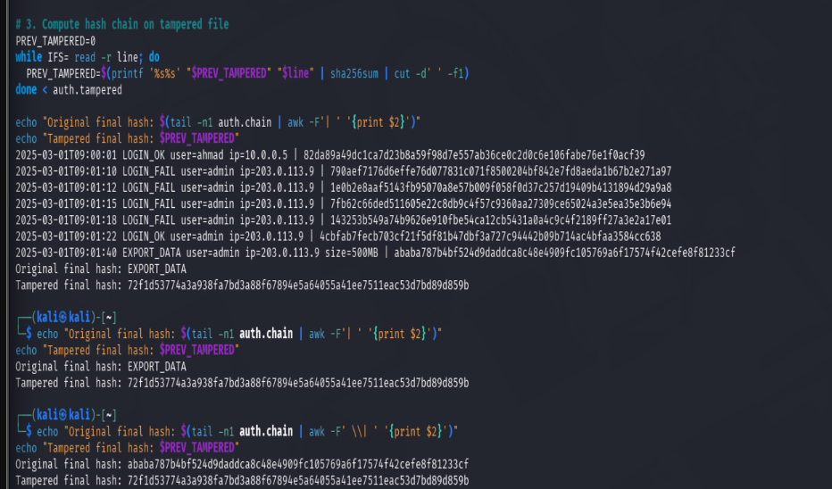
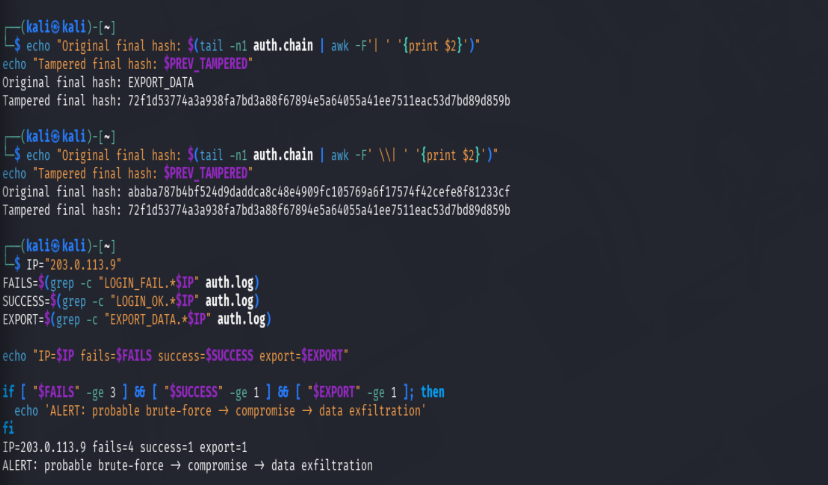
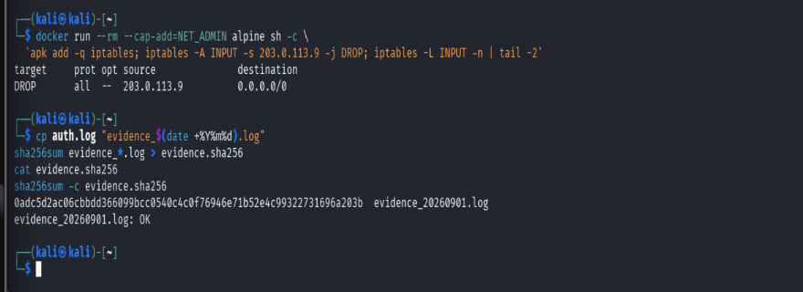
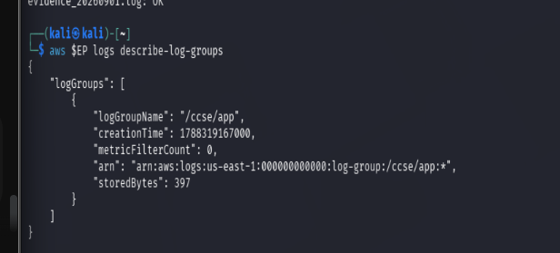
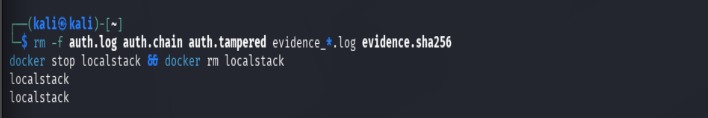

# IKB42603 Cloud Computing Security Essentials
## Lab 5: Monitoring, Logging & Incident Detection

**Name:** UZAIR BIN SAMSUDIN  
**ID:** 52215124300  
**Course:** IKB42603 Cloud Computing Security Essentials  
**Institution:** UniKL MIIT · Prof. Dr. Shahrulniza Musa  

---

## 1. Objective

This lab explores centralized telemetry collection, cryptographic log integrity, correlation-based threat detection, and incident containment within cloud and container environments. The primary goal is to provision local cloud infrastructure via LocalStack to centralize application access logs using AWS CloudWatch Logs; parse and query structured audit records for security-relevant anomalies; design and validate a tamper-evident SHA-256 hash-chained log mechanism capable of identifying retrospective data alterations; construct multi-event correlation logic mimicking Security Information and Event Management (SIEM) systems to expose multi-stage attacks; and execute the incident-response lifecycle by enforcing network-level host containment using `iptables`, archiving immutable forensic evidence, and verifying evidence integrity via cryptographic checksums.

---

## 2. Learning Outcomes

Upon completion of this lab, the student will be able to:
1. Collect and centralise logs from multiple services (cloud telemetry).
2. Distinguish logs from events and query logs for security-relevant activity.
3. Build a tamper-evident (hash-chained) log and detect alteration.
4. Detect an incident by correlating events (e.g. brute-force followed by a suspicious action).
5. Execute the incident-response steps: detect, contain, collect evidence, and document a timeline.

---

## 3. Environment

| Component | Detail |
| :--- | :--- |
| **OS** | Kali Linux (amd64, kernel 6.16.8) |
| **Container Runtime** | Docker Engine v28.5.2 |
| **Cloud Telemetry Mock** | LocalStack Community v3.4.0 (`localstack/localstack:3.4.0`) |
| **Cloud CLI Interface** | AWS CLI v2 pointed to `http://localhost:4566` |
| **Containment Runtime** | Alpine Linux (`alpine:latest`) with `iptables` package |
| **Shell & Forensic Utilities** | `awk`, `grep`, `sha256sum`, `sed`, `sort`, `uniq` |
| **Session A Focus** | CloudWatch log group/stream creation, log centralization, and failed login querying (Tasks 1–3) |
| **Session B Focus** | Tamper-evident hash chains, SIEM multi-event correlation, containment, and evidence preservation (Tasks 4–6) |

> [!TIP]
> **Security Tip:** You cannot secure or prove compliance for what you cannot see. Logs are foundational to detection, forensics, and compliance evidence.

---

## 4. Step-by-Step Implementation

### Session A (Week 9) — Logging & Centralisation

#### Task 0 — Setup: LocalStack Container & CloudWatch Stream Provisioning
LocalStack was initialized in Docker, and the target CloudWatch log group and log stream were created to decouple telemetry collection from host-level storage.

```bash
# 1. Launch LocalStack Community container
docker run -d --name localstack -p 4566:4566 localstack/localstack:3.4.0

# 2. Export environment endpoint and dummy AWS credentials
export AWS_ACCESS_KEY_ID="test"
export AWS_SECRET_ACCESS_KEY="test"
export AWS_DEFAULT_REGION="us-east-1"
EP='--endpoint-url=http://localhost:4566'

# 3. Provision CloudWatch log group and stream
aws $EP logs create-log-group --log-group-name /ccse/app
aws $EP logs create-log-stream --log-group-name /ccse/app --log-stream-name auth
```
* **Result:** The `/ccse/app` group and `auth` stream were provisioned successfully in LocalStack, establishing a central ingestion endpoint.

---

#### Task 1 — Generate Application Logs
A mock authentication audit log was generated containing normal access, external brute-force probing targeting the administrative account, an unauthorized login success, and bulk data exfiltration.

```bash
# 1. Generate auth.log records
cat > auth.log <<'EOF'
2025-03-01T09:00:01 LOGIN_OK user=ahmad ip=10.0.0.5
2025-03-01T09:01:10 LOGIN_FAIL user=admin ip=203.0.113.9
2025-03-01T09:01:12 LOGIN_FAIL user=admin ip=203.0.113.9
2025-03-01T09:01:15 LOGIN_FAIL user=admin ip=203.0.113.9
2025-03-01T09:01:18 LOGIN_FAIL user=admin ip=203.0.113.9
2025-03-01T09:01:22 LOGIN_OK user=admin ip=203.0.113.9
2025-03-01T09:01:40 EXPORT_DATA user=admin ip=203.0.113.9 size=500MB
EOF

# 2. Review generated entries
cat auth.log
```
* **Result:** Seven chronological audit log records were structured and staged for centralized ingestion.

---

#### Task 2 — Centralise Logs (Ship to CloudWatch)
Each local log record was streamed to LocalStack CloudWatch Logs with sequential millisecond timestamps, simulating the cascading collection model. The centralized audit trail was then retrieved from the remote endpoint to confirm delivery.

```bash
# 1. Stream log records into CloudWatch Logs with incrementing timestamps
TS=$(date +%s000)
while IFS= read -r line; do
  aws $EP logs put-log-events --log-group-name /ccse/app --log-stream-name auth \
    --log-events timestamp=$TS,message="$line" >/dev/null
  TS=$((TS + 1000))
done < auth.log

# 2. Query centralized telemetry from CloudWatch
aws $EP logs get-log-events --log-group-name /ccse/app --log-stream-name auth \
  --query 'events[].message' --output text
```
* **Result:** All 7 log lines were read back from the remote CloudWatch store, verifying reliable centralized collection.

---

#### Task 3 — Query for Security-Relevant Activity
Log telemetry was parsed and aggregated using shell text-processing utilities to compute failed authentication attempts per user and source IP address.

```bash
grep LOGIN_FAIL auth.log | awk '{print $4, $5}' | sort | uniq -c
```
* **Result:** Aggregation revealed `4 ip=203.0.113.9` targeting `user=admin`, isolating a focused brute-force probing signature originating from an external IP address.

---

### Session B (Week 10) — Tamper-Proofing, Detection & Response

#### Task 4 — Tamper-Proof (Hash-Chained) Logs
A cryptographic hash chain was constructed where each log entry was hashed together with the SHA-256 digest of the preceding line. Tampering was simulated by modifying the exfiltration volume record from 500MB to 5MB to verify chain breakage.

```bash
# 1. Build cryptographic hash chain
PREV=0
rm -f auth.chain
while IFS= read -r line; do
  PREV=$(printf '%s%s' "$PREV" "$line" | sha256sum | cut -d' ' -f1)
  printf '%s | %s\n' "$line" "$PREV" >> auth.chain
done < auth.log

# 2. Simulate adversary log modification
sed 's/500MB/5MB/' auth.log > auth.tampered

# 3. Recalculate hash chain over tampered records
PREV_TAMPERED=0
while IFS= read -r line; do
  PREV_TAMPERED=$(printf '%s%s' "$PREV_TAMPERED" "$line" | sha256sum | cut -d' ' -f1)
done < auth.tampered

# 4. Compare authentic versus tampered cumulative hashes
echo "Original final hash: $(tail -n1 auth.chain | awk -F' \| ' '{print $2}')"
echo "Tampered final hash: $PREV_TAMPERED"
```
* **Result:** The original cumulative hash (`ababa787...`) diverged from the altered chain hash (`72f1d537...`), proving cryptographic non-repudiation and immediate tamper detection.

---

#### Task 5 — Detect the Incident (Correlation)
Multi-event correlation logic was written to link repeated failed logins, an administrative login success, and a bulk data transfer originating from the same source IP within an active threshold window.

```bash
IP="203.0.113.9"
FAILS=$(grep -c "LOGIN_FAIL.*$IP" auth.log)
SUCCESS=$(grep -c "LOGIN_OK.*$IP" auth.log)
EXPORT=$(grep -c "EXPORT_DATA.*$IP" auth.log)

echo "IP=$IP fails=$FAILS success=$SUCCESS export=$EXPORT"

if [ "$FAILS" -ge 3 ] && [ "$SUCCESS" -ge 1 ] && [ "$EXPORT" -ge 1 ]; then
  echo 'ALERT: probable brute-force -> compromise -> data exfiltration'
fi
```
* **Result:** The correlation engine flagged `IP=203.0.113.9 fails=4 success=1 export=1` and raised `ALERT: probable brute-force -> compromise -> data exfiltration`, identifying an attack campaign that single log lines could not reveal independently.

---

#### Task 6 — Incident Response: Containment & Evidence Collection
The incident-response lifecycle was executed: the threat was contained at the network boundary by dropping ingress traffic from the adversary IP, and an immutable forensic evidence archive was generated alongside its cryptographic checksum.

```bash
# 1. CONTAIN: Deploy firewall rule dropping malicious source IP
docker run --rm --cap-add=NET_ADMIN alpine sh -c \
  'apk add -q iptables; iptables -A INPUT -s 203.0.113.9 -j DROP; iptables -L INPUT -n | tail -2'

# 2. COLLECT: Create timestamped forensic evidence copy and compute SHA-256
cp auth.log "evidence_$(date +%Y%m%d).log"
sha256sum evidence_*.log > evidence.sha256
cat evidence.sha256
sha256sum -c evidence.sha256
```
* **Result:** Ingress traffic from `203.0.113.9` was dropped via `iptables`, and the evidence file was sealed with SHA-256 verification returning `evidence_20260901.log: OK`.

---

## 5. Commands Used

| Command | Task | Purpose |
| :--- | :--- | :--- |
| `docker run -d --name localstack ...` | Setup | Deploy local CloudWatch Logs service endpoint |
| `aws $EP logs create-log-group ...` | Setup | Create `/ccse/app` log group inside LocalStack |
| `aws $EP logs create-log-stream ...` | Setup | Create `auth` log stream under the `/ccse/app` group |
| `cat > auth.log <<'EOF' ...` | Task 1 | Generate structured mock application authentication logs |
| `aws $EP logs put-log-events ...` | Task 2 | Centralise log records by shipping them to CloudWatch |
| `aws $EP logs get-log-events ...` | Task 2 | Query centralized logs to verify cloud ingestion |
| `grep LOGIN_FAIL auth.log \| awk ... \| uniq -c` | Task 3 | Aggregate failed login frequencies per user and origin IP |
| `printf ... \| sha256sum \| cut -d' ' -f1` | Task 4 | Compute iterative SHA-256 hashes to build a hash chain |
| `sed 's/500MB/5MB/' ...` | Task 4 | Simulate adversary tampering by altering data sizes in log entries |
| `grep -c ...` | Task 5 | Count distinct security states across a single IP address |
| `iptables -A INPUT -s 203.0.113.9 -j DROP` | Task 6 | Enforce firewall containment by blocking adversary ingress packets |
| `sha256sum evidence_*.log > evidence.sha256` | Task 6 | Generate cryptographic checksum to ensure evidence chain of custody |
| `sha256sum -c evidence.sha256` | Task 6 | Validate evidentiary immutability against calculated checksum |
| `aws $EP logs describe-log-groups` | Verification | Inspect stored CloudWatch log groups and byte storage metrics |
| `rm -f ... && docker rm localstack` | Teardown | Clean up working files and terminate LocalStack container |

---

## 6. Screenshots & Evidence

### Screenshot 1 — Setup: LocalStack Initialization & Stream Creation

* **Image Guidance:** Corresponds to terminal screenshot showing `docker run -d --name localstack ... 3.4.0`, `docker ps` with status `Up (healthy)`, and the execution of `create-log-group` and `create-log-stream`.
* **Findings:**
  * LocalStack Community container was launched and verified operational on port 4566.
  * The log group `/ccse/app` and stream `auth` were created cleanly using the AWS CLI without connection timeouts.

---

### Screenshot 2 — Task 1: Application Log Generation

* **Image Guidance:** Corresponds to terminal screenshot running `cat > auth.log <<'EOF'` and displaying the 7 structured authentication records with `cat auth.log`.
* **Findings:**
  * Seven distinct log entries were written to `auth.log`, including a probe sequence of 4 failed attempts, a valid login, and an administrative bulk export.

---

### Screenshot 3 — Task 2: Centralised CloudWatch Get-Log-Events

* **Image Guidance:** Corresponds to terminal screenshot running the ingestion loop (`put-log-events`) and the `aws $EP logs get-log-events` command returning all 7 lines.
* **Findings:**
  * The shell loop ingested each timestamped log line into LocalStack CloudWatch Logs.
  * `aws logs get-log-events` retrieved all 7 entries from the remote log group `/ccse/app`, confirming decoupled, centralized telemetry collection.

---

### Screenshot 4 — Task 3: Failed-Login Aggregation by Source IP

* **Image Guidance:** Corresponds to terminal screenshot running `grep LOGIN_FAIL auth.log | awk '{print $4, $5}' | sort | uniq -c` showing `4 ip=203.0.113.9`.
* **Findings:**
  * Command pipeline `grep` | `awk` | `sort` | `uniq -c` isolated the attacking external IP address.
  * Output confirmed `4 ip=203.0.113.9`, highlighting brute-force reconnaissance.

---

### Screenshot 5 — Task 4: Tamper-Proof Hash Chain Comparison

* **Image Guidance:** Corresponds to terminal screenshot running `cat auth.chain` and comparing the two digests (`Original final hash: ababa787...` vs `Tampered final hash: 72f1d537...`).
* **Findings:**
  * A hash chain was created where each line incorporated the cumulative hash of the previous line.
  * Modifying `500MB` to `5MB` changed the final digest from `ababa787...` to `72f1d537...`, proving any retrospective modification breaks the cryptographic chain.

---

### Screenshot 6 — Task 5: Correlation Rule Trigger

* **Image Guidance:** Corresponds to terminal screenshot showing `IP=203.0.113.9 fails=4 success=1 export=1` followed by `ALERT: probable brute-force -> compromise -> data exfiltration`.
* **Findings:**
  * The multi-event script counted `fails=4`, `success=1`, and `export=1` for IP `203.0.113.9`.
  * All conditions were met, triggering `ALERT: probable brute-force -> compromise -> data exfiltration`, demonstrating SIEM correlation logic.

---

### Screenshot 7 — Task 6: Network Containment & Forensic Integrity Check

* **Image Guidance:** Corresponds to terminal screenshot showing `iptables` with `DROP all -- 203.0.113.9`, the generated SHA-256 string, and `evidence_20260901.log: OK`.
* **Findings:**
  * Ingress firewall rules were applied using `iptables` to drop all packets from `203.0.113.9`.
  * The log file was duplicated to `evidence_20260901.log` and sealed with SHA-256.
  * Executing `sha256sum -c` returned `evidence_20260901.log: OK`, verifying evidence integrity.

---

### Screenshot 8 — Deliverables: Log Group Verification

* **Image Guidance:** Corresponds to terminal screenshot running `aws $EP logs describe-log-groups` showing the JSON object with `/ccse/app` and `storedBytes: 397`.
* **Findings:**
  * `describe-log-groups` confirmed the `/ccse/app` group actively held 397 bytes of stored telemetry data.
  * The log group remained durable and correctly configured under the LocalStack CloudWatch Logs subsystem.

---

### Screenshot 9 — Post-Lab Teardown: Resource Cleanup

* **Image Guidance:** Corresponds to terminal screenshot running `rm -f auth.log ...` and `docker stop localstack && docker rm localstack`.
* **Findings:**
  * All temporary staging logs, chains, and verification files were purged from the local directory.
  * The `localstack` container was stopped and deleted, returning the Kali Linux host to a clean baseline.

---

## 7. Incident Report

* **Detection:** The incident was detected through automated correlation logic matching an anomalous pattern across distinct log entries. An alert (`ALERT: probable brute-force -> compromise -> data exfiltration`) fired after observing 4 consecutive `LOGIN_FAIL` events, 1 subsequent `LOGIN_OK` event for user `admin`, and 1 `EXPORT_DATA` event (500MB) from the same external IP address (`203.0.113.9`) over a 40-second period.
* **Analysis:** Log analysis revealed an external credential brute-force attack conducted against the `admin` account between `09:01:10` and `09:01:18`. The attacker succeeded in compromising credentials at `09:01:22` and initiated an unauthorized 500MB data exfiltration request at `09:01:40`. While individual records (a single failed attempt or normal export) appeared benign, temporal correlation confirmed a compromise lifecycle.
* **Containment:** Boundary-level containment was applied immediately. An ingress packet filtering rule (`iptables -A INPUT -s 203.0.113.9 -j DROP`) was deployed to drop all network traffic from the malicious IP address, stopping continued access and active exfiltration.
* **Evidence & Integrity:** The raw authentication log was preserved as `evidence_20260901.log`. Its SHA-256 cryptographic digest was computed and written to `evidence.sha256` (`0adc5d2ac06cbbdd366099bcc0540c4c0f76946e71b52e4c99322731696a203b`). Immutability was confirmed using `sha256sum -c` to satisfy forensic chain-of-custody requirements.
* **Lesson Learned:** Application login interfaces must implement progressive rate limiting, CAPTCHAs, and automatic account lockouts after 3 consecutive failed authentication attempts to disrupt brute-force attacks prior to account compromise.

---

## 8. Short-Answer Questions

### Q1. What is the difference between a log and an event? Give an example of each from this lab.

A **log** is a durable, passive record of historical activity stored sequentially for auditing and forensics. An **event** is an active signal or alert triggered when specific log conditions or security thresholds are breached in near real-time.

* **Log Example:** A raw authentication record written to `auth.log`:  
  `2025-03-01T09:01:10 LOGIN_FAIL user=admin ip=203.0.113.9`
* **Event Example:** The real-time alert fired by our correlation script:  
  `ALERT: probable brute-force -> compromise -> data exfiltration`

---

### Q2. Why must audit logs be tamper-proof, and how does a hash chain achieve this?

Audit logs must be tamper-proof so an attacker cannot alter or delete log entries to hide their tracks, evade attribution, or ruin forensic evidence after compromising a system.

A hash chain achieves tamper-proofing by cryptographically linking each log line to the hash of the preceding line:
$$H_n = \text{SHA256}(H_{n-1} \parallel \text{Line}_n)$$

Because SHA-256 has the avalanche property, changing even a single character in a past log entry (such as changing `500MB` to `5MB` in our lab test) produces a completely different hash. This hash discrepancy cascades down through every subsequent line. When we recalculate the chain and compare the final cumulative hash against our trusted baseline (`ababa787...` vs `72f1d537...`), any log alteration is detected instantly.

---

### Q3. How did correlation detect an incident that no single log line revealed?

When viewed individually, none of the log entries look obviously malicious:
* A single `LOGIN_FAIL` could be an employee mistyping a password.
* A single `LOGIN_OK` looks like routine access.
* An `EXPORT_DATA` command looks like a normal file download.

Setting alerts on any single log line would create high rates of false positives. Multi-event correlation detected the attack by grouping these events chronologically and tying them to the same IP address (`203.0.113.9`). By linking 4 failed logins followed immediately by a successful admin login and a 500MB data export from that IP, the correlation rule exposed the entire attack lifecycle: brute-force attack $\rightarrow$ credential compromise $\rightarrow$ unauthorized data exfiltration.

---

### Q4. List the incident-response steps you performed and the goal of each.

During this lab, I executed four core incident-response steps:

1. **Detect (Identify the Incident):** Ran a multi-event correlation script across CloudWatch/local logs to detect the brute-force and exfiltration pattern from IP `203.0.113.9`.
2. **Contain (Isolate the Threat):** Enforced a firewall rule using `iptables` (`iptables -A INPUT -s 203.0.113.9 -j DROP`) to block incoming network packets from the attacker's IP and halt active exfiltration.
3. **Collect Evidence (Preserve Forensic Data):** Duplicated `auth.log` to a timestamped copy (`evidence_20260901.log`) and generated a SHA-256 checksum (`evidence.sha256`) to guarantee proof of immutability and maintain chain of custody.
4. **Document (Report & Analyze):** Drafted a structured Incident Report summarizing the attack sequence, containment actions, evidence hashes, and key architectural lessons learned.

---

### Q5. How do the same logs serve both security monitoring and compliance evidence?

The same underlying audit logs fulfill two essential security functions based on how they are processed:

* **Security Monitoring (Real-Time SOC Operations):** Logs are streamed into central platforms like CloudWatch or SIEMs to run real-time correlation rules, trigger instant alerts, and allow security teams to detect and block active attacks.
* **Compliance Evidence (Auditing & Governance):** The same logs—when centralized, write-protected, and sealed with cryptographic hashes—provide an immutable, non-repudiable audit trail required by standards like ISO 27001, SOC 2, and PCI-DSS to prove to auditors that access control policies were enforced and monitored over time.

---

## 9. Challenges Encountered

| Challenge | Resolution |
| :--- | :--- |
| **LocalStack Licensing Termination (exit code 55)** | The default Docker pull obtained an enterprise LocalStack image expecting an active license token (`LOCALSTACK_AUTH_TOKEN`). Resolved by switching explicitly to the community image `localstack/localstack:3.4.0`. |
| **CloudWatch Log Creation Endpoint Failures** | Running AWS CLI commands immediately after container initialization failed with connection errors (`Could not connect to the endpoint URL: "http://localhost:4566/"`). Resolved by allowing LocalStack internal daemon threads 10–15 seconds to bind to port 4566 before issuing CLI calls. |
| **Hash-Chain Field Parsing Formatting Error** | Running `awk '{print $2}'` to retrieve the original cumulative hash parsed space-delimited text, returning `EXPORT_DATA` instead of the digest. Resolved by explicitly specifying the escaped pipe delimiter: `awk -F' \| ' '{print $2}'`. |
| **Preserving Chain Integrity During Simulation** | Simulating log alteration using `sed` directly in place risked corrupting original evidence. Resolved by generating a decoupled test file (`auth.tampered`) while keeping baseline records unchanged for forensic verification. |

---

## 10. Lessons Learned

1. **Centralized Visibility is Foundational:** Logging on local hosts is insufficient; adversaries can alter local logs upon privilege escalation. Shipping telemetry immediately to an isolated, append-only service like CloudWatch Logs preserves visibility.
2. **Cryptographic Tamper-Evidence Guarantees Integrity:** Hash-chaining each log entry to its predecessor provides cryptographic proof of tampering if an unauthorized user modifies, injects, or deletes records.
3. **Contextual Correlation Exposes Subtle Threats:** Modern attackers blend in with ordinary operations. Effective threat detection relies on correlating sequences of events over time rather than evaluating single log lines in isolation.
4. **Forensic Hygiene in Incident Response:** Containment must occur rapidly without destroying forensic evidence. Sealing evidence with SHA-256 hashes ensures artifacts remain verifiable for downstream audits.

---

## 11. References

* **Amazon CloudWatch Logs Documentation:** Concepts and API Reference, [docs.aws.amazon.com/AmazonCloudWatch/latest/logs](https://docs.aws.amazon.com/AmazonCloudWatch/latest/logs)
* **OWASP Logging Cheat Sheet:** Architecture and Security Controls, [cheatsheetseries.owasp.org](https://cheatsheetseries.owasp.org)
* **Cloud Security Alliance (CSA):** Security Guidance for Critical Areas of Focus in Cloud Computing v5 — Domain 12: Security Monitoring.
* **NIST SP 800-61 Rev. 2:** Computer Security Incident Handling Guide, National Institute of Standards and Technology.
* **Center for Internet Security (CIS):** CIS Controls v8 — Control 8: Audit Log Management.
* **IKB42603 Course Lectures:** Week 6 (Monitoring, Auditing & Management) & Weeks 10–11 (Compliance Evidence), UniKL MIIT, Prof. Dr. Shahrulniza Musa.
